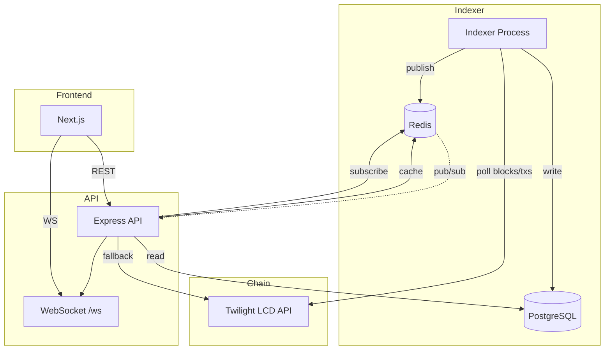
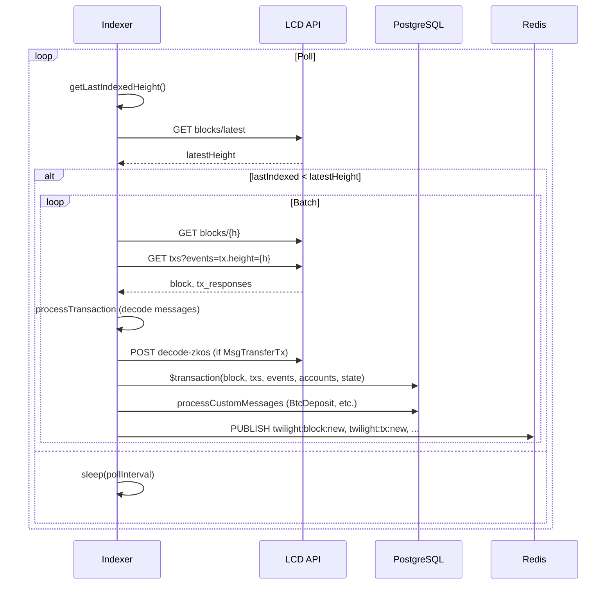

# Twilight Explorer — Indexer & API Architecture

**Technical Design Document**  
Chain: Twilight (Cosmos SDK–based, chain ID `nyks`)

---

## 1. System Overview

### Pipeline Summary

The Twilight Explorer ingests blockchain data from the Twilight LCD API via polling, indexes blocks and transactions into PostgreSQL, publishes real-time events to Redis pub/sub, and serves data through an Express REST API with WebSocket support. The Next.js frontend consumes both the REST API and WebSocket for live updates. Withdrawals are additionally synced from a dedicated LCD endpoint on the API server every 20 minutes.

**Flow:** Chain/LCD → Indexer → PostgreSQL + Redis pub/sub → API (Express) → REST + WebSocket → Frontend (Next.js)

### Components

| Component | Path | Responsibility |
|-----------|------|----------------|
| **Indexer** | `packages/indexer/` | Polls LCD, decodes tx messages, writes blocks/txs/events/custom data to Postgres, publishes events to Redis |
| **API** | `packages/api/` | REST API (blocks, txs, accounts, stats, twilight modules), WebSocket server, withdrawal sync from LCD |
| **Web** | `packages/web/` | Next.js frontend; consumes API and WebSocket |
| **Workers/cron** | — | No separate workers. API runs `syncWithdrawals()` on startup and every 20 min via `setInterval`. |

### Runtime Topology

| Mode | Setup |
|------|-------|
| **Local dev** | `npm run dev` (turbo); Postgres + Redis via `docker-compose up -d`. Indexer, API, Web run as separate Node processes. |
| **Production** | TODO: No Dockerfiles or deployment manifests. Single-host assumed; API and WebSocket share one HTTP server. |

---

## 2. Data Sources & Ingestion

### Chain Endpoints

- **LCD base:** `TWILIGHT_LCD_URL` (default `https://lcd.twilight.org`)
- **RPC/WebSocket:** None. LCD only.

### LCD Routes Used

**Indexer:**

| Path | Purpose |
|------|---------|
| `GET /cosmos/base/tendermint/v1beta1/blocks/latest` | Latest block header |
| `GET /cosmos/base/tendermint/v1beta1/blocks/{height}` | Block by height |
| `GET /cosmos/tx/v1beta1/txs?events=tx.height={height}&pagination.limit=100` | Txs by block height |

**API (hydration/fallback):**

| Path | Purpose |
|------|---------|
| `GET /twilight-project/nyks/bridge/withdraw_btc_request_all` | Withdrawal list (synced every 20 min) |
| `GET /cosmos/bank/v1beta1/balances/{address}` | Account balances (accounts route) |
| `GET /cosmos/tx/v1beta1/txs/{hash}` | Tx by hash (fallback when not in DB) |
| `GET /twilight-project/nyks/volt/get_all_fragments` | Live fragments (cached) |
| `GET /twilight-project/nyks/bridge/propose_sweep_addresses_all/{limit}` | Sweep addresses (cached) |
| `GET /cosmos/staking/v1beta1/validators` | Validators (cached) |

**External API (zkOS decode):**

| Path | Purpose |
|------|---------|
| `POST {ZKOS_DECODE_URL}/api/decode-zkos-transaction` | Decode zkOS tx bytecode (indexer + API) |

### Ingestion Strategy

- **Mode:** Polling only (no subscriptions)
- **Block range:** Sequential from `lastIndexedHeight + 1` to `min(lastIndexedHeight + batchSize, latestHeight)`
- **Head tracking:** `IndexerState.key = 'lastIndexedHeight'` stores last processed height
- **Poll interval:** `INDEXER_POLL_INTERVAL` (default 2000 ms) when caught up

### Confirmation / Finality

- **Confirmations:** None explicitly. Indexer processes whatever LCD returns as latest.
- **Reorg handling:** None. Cosmos reorg risk is low; no rollback logic.

---

## 3. Indexer Architecture

### Internal Modules

| File | Purpose |
|------|---------|
| `packages/indexer/src/index.ts` | Entry; init Redis, DB, LCD; start sync loop; wire event publishing |
| `packages/indexer/src/sync.ts` | Main loop, `processBlock`, `processTransaction`, `processCustomMessages`, `updateAccounts` |
| `packages/indexer/src/lcd-client.ts` | HTTP client for LCD (axios, 30s timeout) |
| `packages/indexer/src/config.ts` | Env-based config |
| `packages/indexer/src/logger.ts` | Pino logger |
| `packages/indexer/src/decoders/index.ts` | Message router; delegates to module decoders |
| `packages/indexer/src/decoders/bridge.ts` | Bridge module (17 msg types) |
| `packages/indexer/src/decoders/forks.ts` | Forks module (2 msg types) |
| `packages/indexer/src/decoders/volt.ts` | Volt module (2 msg types) |
| `packages/indexer/src/decoders/zkos.ts` | zkOS module (2 msg types); calls external decode API |
| `packages/indexer/src/decoders/types.ts` | Message type constants, module mapping |

### Execution Model

- **Threading:** Single-threaded async loop
- **Batching:** `batchSize` blocks per iteration (default 10 via `INDEXER_BATCH_SIZE`)

### Decode Strategy

1. Fetch block header + txs by height
2. For each tx: parse `body.messages`, extract `auth_info.signer_infos` for signers
3. Decode each message via `decodeMessage()` → module-specific decoder (bridge/forks/volt/zkos)
4. zkOS `MsgTransferTx`: call `POST {ZKOS_DECODE_URL}/api/decode-zkos-transaction` with `tx_byte_code`
5. Store decoded messages in `Transaction.messages` (JSON)
6. `processCustomMessages()` maps msg types to DB writes (e.g. BtcDeposit, SweepSignature, ZkosTransfer)

### Module Mapping

| Module | Message types (examples) | DB tables |
|--------|--------------------------|-----------|
| bridge | MsgConfirmBtcDeposit, MsgRegisterBtcDepositAddress, MsgSweepProposal, MsgSignSweep, … | BtcDeposit, BtcDepositAddress, SweepProposal, SweepSignature, RefundSignature |
| forks | MsgSetDelegateAddresses, MsgSeenBtcChainTip | DelegateKey, BtcChainTip |
| volt | MsgSignerApplication, MsgAcceptSigners | FragmentSigner |
| zkos | MsgTransferTx, MsgMintBurnTradingBtc | ZkosTransfer, ZkosMintBurn |

**Note:** Withdrawals are not indexed from txs; API syncs from LCD. BOOTSTRAP_FRAGMENT is logged but not persisted. REGISTER_RESERVE_ADDRESS is decoded but not written to `Reserve` table.

### Idempotency

- **Blocks:** `upsert` by `height`
- **Transactions:** `upsert` by `hash`
- **Events:** `create` (no unique constraint; duplicates possible)
- **Custom tables:** `upsert` where unique keys exist (e.g. `BtcDepositAddress.btcDepositAddress`, `SweepSignature-[reserveId,roundId,signerAddress]`)

### Backfill Strategy

- **Start height:** `INDEXER_START_HEIGHT` (default 1)
- **Resume:** `getLastIndexedHeight()` from `IndexerState`; no checkpoint files
- **Full resync:** TODO: Manual; e.g. `prisma db push --force-reset` + restart indexer

### Error Handling

- **Block failure:** Log error, `sleep(5000)`, `break` out of batch (retry same block next loop)
- **Custom message failure:** Log, continue with next message (per-msg try/catch)
- **zkOS decode failure:** Return null; store ZkosTransfer without full decodedData
- **Redis down:** Indexer continues; events not published; WS clients get no real-time updates

### Performance

- **Throughput:** Not measured. Sequential processing; zkOS decode API can be a bottleneck.
- **Bottlenecks:** External zkOS API latency; LCD rate limits.

---

## 4. Postgres Data Model

### Schema (Prisma)

**File:** `prisma/schema.prisma`

### Core Tables

| Table | PK | Key indexes | Stores |
|-------|-----|-------------|--------|
| Block | height | timestamp, proposer | Block header, txCount, gasUsed, gasWanted |
| Transaction | id | hash (unique), blockHeight, type, blockTime, signers | Tx hash, blockHeight, type, messages (JSON), status, signers |
| Event | id | type, blockHeight, txHash | Event type, attributes (JSON) |
| Account | address | lastSeen, accountType | balance, txCount, firstSeen, lastSeen |
| IndexerState | key | — | lastIndexedHeight |

### Bridge Module

| Table | PK | Notable constraints |
|-------|-----|----------------------|
| BtcDeposit | id | @@unique([btcHash, twilightDepositAddress]) |
| BtcDepositAddress | id | btcDepositAddress unique |
| BtcWithdrawal | id | withdrawIdentifier unique |
| Reserve | id (BigInt) | — |
| SweepProposal | id | — |
| SweepSignature | id | @@unique([reserveId, roundId, signerAddress]) |
| RefundSignature | id | @@unique([reserveId, roundId, signerAddress]) |

### Forks Module

| Table | PK | Notable constraints |
|-------|-----|----------------------|
| DelegateKey | id | validatorAddress unique |
| BtcChainTip | id | @@unique([btcHeight, btcOracleAddress]) |

### Volt Module

| Table | PK | Notable constraints |
|-------|-----|----------------------|
| Fragment | id (BigInt) | — |
| FragmentSigner | id | @@unique([fragmentId, signerAddress]) |
| ClearingAccount | twilightAddress | — |

### zkOS Module

| Table | PK | Notable constraints |
|-------|-----|----------------------|
| ZkosTransfer | id | zkTxId unique |
| ZkosMintBurn | id | — |

### Relationships

- `Block` 1 → N `Transaction`, `Block` 1 → N `Event`
- `Transaction` 1 → N `Event` (via txHash)
- No materialized views

### Migration

- **Tool:** Prisma migrations
- **Current:** `prisma/migrations/20240204_add_program_type/`
- **Policy:** TODO: No documented versioning policy

---

## 5. Redis Usage

### Roles

| Role | Component | Notes |
|------|-----------|-------|
| **Cache** | API | Response caching for stats, blocks, txs, validators, fragments, sweep addresses |
| **Pub/sub** | Indexer → API | Indexer publishes; API WS server subscribes |
| **Rate limiting** | — | Not via Redis; express-rate-limit in-memory |

### Key Patterns

| Pattern | Example | TTL (s) |
|---------|---------|---------|
| `cache:stats` | Overall stats | 30 |
| `cache:module-stats` | Module stats | 60 |
| `cache:blocks:{page}:{limit}` | Blocks list | 10 |
| `cache:txs:{page}:{limit}:{filters}` | Tx list | 10 |
| `cache:tx:{hash}` | Tx detail | 300 |
| `cache:zkos:{txHash}` | zkOS decoded | 3600 |
| `cache:validators:{status}:{limit}` | Validators | 600 |
| `cache:validator-count:{status}` | Validator count | 600 |
| `cache:validator-blocks:{address}` | Validator blocks | 30 |
| `cache:fragments:live` | Live fragments (LCD) | 600 |
| `cache:fragment:{id}` | Single fragment | 600 |
| `cache:sweep-addresses:{limit}` | Sweep addresses | 600 |

### Pub/Sub Channels

| Channel | Publisher | Payload |
|---------|-----------|---------|
| `twilight:block:new` | Indexer | `{ height, hash, timestamp, txCount, gasUsed, gasWanted }` |
| `twilight:tx:new` | Indexer | Processed tx object |
| `twilight:deposit:new` | Indexer | Deposit data |
| `twilight:withdrawal:new` | Indexer | Withdrawal data (from MsgWithdrawBtcRequest; full sync via API) |

### Redis Down

- **Cache:** API falls through to DB/LCD; no cache
- **Pub/sub:** WS server receives no events; clients see no real-time updates

---

## 6. API Server (Express + Prisma)

### API Surface

**Base path:** `/api`

| Category | Endpoints |
|----------|-----------|
| **Blocks** | `GET /api/blocks`, `GET /api/blocks/latest`, `GET /api/blocks/:height`, `GET /api/blocks/:height/transactions` |
| **Transactions** | `GET /api/txs`, `GET /api/txs/recent`, `GET /api/txs/types/stats`, `GET /api/txs/script/:scriptAddress`, `GET /api/txs/:hash` |
| **Accounts** | `GET /api/accounts`, `GET /api/accounts/:address`, `GET /api/accounts/:address/transactions` |
| **Stats** | `GET /api/stats`, `GET /api/stats/charts/blocks`, `GET /api/stats/charts/transactions`, `GET /api/stats/modules`, `GET /api/stats/network-performance`, `GET /api/stats/active-accounts`, `GET /api/stats/bridge-analytics`, `GET /api/stats/fragment-health` |
| **Validators** | `GET /api/validators`, `GET /api/validators/count`, `GET /api/validators/:address/blocks`, `GET /api/validators/:address` |
| **Twilight** | `GET /api/twilight/deposits`, `GET /api/twilight/deposits/:id`, `GET /api/twilight/withdrawals`, `GET /api/twilight/withdrawals/:id`, `GET /api/twilight/reserves`, `GET /api/twilight/reserves/:id`, `GET /api/twilight/sweep-addresses`, `GET /api/twilight/fragments/live`, `GET /api/twilight/fragments/live/:id`, `GET /api/twilight/fragments`, `GET /api/twilight/fragments/:id`, `GET /api/twilight/fragment-signers`, `GET /api/twilight/zkos/transfers`, `GET /api/twilight/zkos/transfers/:txId`, `GET /api/twilight/zkos/mint-burns`, `GET /api/twilight/delegates`, `GET /api/twilight/search` |

### Query Patterns

- **Pagination:** `page`, `limit` (default 20, max 100); response shape `{ data, pagination: { page, limit, total, totalPages } }`
- **Tx filters:** `type`, `status` (success|failed), `module` (bridge|forks|volt|zkos), `programType` (zkOS)
- **Deposits/withdrawals:** `search`, `address`, `reserveAddress`, `withdrawAddress`, `confirmed`
- **Sorting:** DB `orderBy`; typically `blockHeight desc` or `blockTime desc`

### Caching

- **Pattern:** `withCache(key, ttl, fetchFn)` in `packages/api/src/cache.ts`
- **Invalidation:** TTL-based only; no explicit invalidation on write

### Error Model

- **200:** Success
- **400:** Invalid params (Zod validation)
- **404:** Not found
- **500:** Internal server error `{ error: "Internal server error" }`
- **503:** Health check failure `{ status: "unhealthy", error: "..." }`

---

## 7. WebSocket / Realtime

### Path

- `ws://{host}:{port}/ws` (same server as REST API)

### Events Streamed

| Event type | Channel | When |
|------------|---------|------|
| `block` | twilight:block:new | New block indexed |
| `tx` | twilight:tx:new | New tx indexed |
| `deposit` | twilight:deposit:new | New BtcDeposit |
| `withdrawal` | twilight:withdrawal:new | MsgWithdrawBtcRequest seen (full data from API sync) |

### Event Format

```json
{
  "type": "block",
  "data": {
    "height": 12345,
    "hash": "ABC...",
    "timestamp": "2025-02-11T12:00:00.000Z",
    "txCount": 5,
    "gasUsed": "100000",
    "gasWanted": "200000"
  },
  "timestamp": "2025-02-11T12:00:00.100Z"
}
```

### Subscription Model

- **Default:** Client subscribed to `*` (all channels)
- **Client actions:** `subscribe`, `unsubscribe`, `subscribe_all`, `unsubscribe_all`, `ping`
- **Filtering:** Server; client receives only events for subscribed channels

### Consistency

- Events emitted after successful DB write. WS matches DB state for newly indexed data.

---

## 8. Stats & Analytics

### Computed Metrics

| Metric | Code path | Logic |
|--------|-----------|-------|
| Total transactions | `packages/api/src/routes/stats.ts` | `prisma.transaction.count()` |
| Transactions 24h | `packages/api/src/routes/stats.ts` | `blockTime >= now - 24h` |
| Active accounts 24h/7d/30d | `packages/api/src/routes/stats.ts` | `lastSeen >= now - window` |
| Bridge volumes | `packages/api/src/routes/stats.ts` | `_sum(depositAmount)`, `_sum(withdrawAmount)` |
| Fragment health | `packages/api/src/routes/stats.ts` | Count by status, avg signers, success rate |
| Network performance | `packages/api/src/routes/stats.ts` | Block time, TPS, gas utilization, proposer distribution |

### Aggregation

- **On-demand:** All stats computed at request time
- **Pre-aggregation:** None
- **Timezone:** Server/local; `new Date()` used for "now"

---

## 9. Configuration & Environments

### Env Vars

**Indexer (`packages/indexer/src/config.ts`):**

| Var | Default | Description |
|-----|---------|-------------|
| DATABASE_URL | (see .env.example) | Postgres connection |
| REDIS_URL | redis://localhost:6379 | Redis for pub/sub |
| TWILIGHT_LCD_URL | https://lcd.twilight.org | LCD base URL |
| ZKOS_DECODE_URL | https://indexer.twilight.org | zkOS decode API |
| INDEXER_START_HEIGHT | 1 | Start height |
| INDEXER_POLL_INTERVAL | 2000 | Poll interval (ms) |
| INDEXER_BATCH_SIZE | 10 | Blocks per batch |
| CHAIN_ID | nyks | Chain ID |

**API (`packages/api/src/config.ts`):**

| Var | Default | Description |
|-----|---------|-------------|
| API_PORT | 3001 | HTTP port |
| API_HOST | 0.0.0.0 | Bind host |
| WS_PORT | 3002 | Unused (WS on same server as API) |
| REDIS_URL | redis://localhost:6379 | Redis for cache + pub/sub |
| CORS_ORIGIN | * | CORS origin |
| TWILIGHT_LCD_URL | https://lcd.twilight.org | LCD base URL |
| ZKOS_DECODE_URL | https://indexer.twilight.org | zkOS decode API |
| rateLimit.windowMs | 60000 | Rate limit window |
| rateLimit.max | 100 | Rate limit max req/window |

**Web (`packages/web/next.config.js`, `src/lib/api.ts`):**

| Var | Default | Description |
|-----|---------|-------------|
| NEXT_PUBLIC_API_URL | https://explorer.twilight.org | API base URL |
| NEXT_PUBLIC_WS_URL | wss://explorer.twilight.org | WS URL |
| NEXT_PUBLIC_UI_THEME | auction | UI theme (auction \| legacy) |

### Ports (Local Dev)

| Service | Port |
|---------|------|
| Web | 3000 |
| API (+ WS) | 3001 |
| Postgres | 5433 (host) → 5432 (container) |
| Redis | 6379 |

### Observability

- **Logging:** Pino (API, indexer); `pino-pretty` for dev
- **Metrics:** None
- **Tracing:** None

---

## 10. Operational Concerns

### Backfill

- Set `INDEXER_START_HEIGHT` to desired height or 1
- Run indexer; it processes from `lastIndexedHeight` or `startHeight - 1`
- TODO: No documented safe backfill procedure (e.g. pause API, avoid conflicts)

### Schema Rotation

- `prisma migrate dev` for dev
- TODO: Production migration strategy (e.g. blue/green, backward-compatible changes)

### Data Consistency

- No automated sanity checks
- TODO: Checks for block hash continuity, tx count vs block.txCount, etc.

### Failure Scenarios

| Scenario | Mitigation |
|----------|------------|
| Indexer crash | Restart; resumes from `lastIndexedHeight` |
| LCD timeout | Axios 30s timeout; block retry after 5s |
| DB connection lost | Indexer/API exit on connection failure |
| Redis down | Cache disabled; WS no real-time; indexer continues |
| zkOS decode API down | ZkosTransfer stored with null decodedData |

---

## 11. Known Gaps / TODO

- **Reorg handling:** None
- **Reserve/Fragment indexing:** REGISTER_RESERVE_ADDRESS, BOOTSTRAP_FRAGMENT not fully persisted
- **Withdrawal source split:** Indexer emits withdrawal event; API syncs full list from LCD
- **Production deployment:** No Dockerfiles, no CI/CD
- **Metrics/tracing:** None
- **Readiness probe:** Only `/health` (DB check); no Redis/LCD check
- **Rate limit:** Not configurable via env
- **Request body size:** No explicit limit
- **CORS:** Default `*` in production

---

## 12. Appendix

### A. High-Level Architecture



### B. Indexing Flow Sequence



### C. Example Payloads

**Decoded tx message → DB write (MsgConfirmBtcDeposit):**

```json
{
  "type": "/twilightproject.nyks.bridge.MsgConfirmBtcDeposit",
  "typeName": "ConfirmBtcDeposit",
  "module": "bridge",
  "data": {
    "reserveAddress": "bc1q...",
    "depositAmount": "100000",
    "btcHeight": "850000",
    "btcHash": "abc123...",
    "twilightDepositAddress": "twilight1...",
    "oracleAddress": "twilight1..."
  }
}
```

→ `BtcDeposit.create({ txHash, blockHeight, reserveAddress, depositAmount, ... })`

**WebSocket event:**

```json
{
  "type": "block",
  "data": {
    "height": 12345,
    "hash": "XYZ789",
    "timestamp": "2025-02-11T12:00:00.000Z",
    "txCount": 3,
    "gasUsed": "150000",
    "gasWanted": "200000"
  },
  "timestamp": "2025-02-11T12:00:00.050Z"
}
```

**API response (`GET /api/txs?page=1&limit=5&module=zkos`):**

```json
{
  "data": [
    {
      "hash": "ABC123",
      "blockHeight": 12340,
      "blockTime": "2025-02-11T11:59:00.000Z",
      "type": "/twilightproject.nyks.zkos.MsgTransferTx",
      "status": "success",
      "gasUsed": "50000",
      "programType": "Transfer"
    }
  ],
  "pagination": {
    "page": 1,
    "limit": 5,
    "total": 42,
    "totalPages": 9
  }
}
```
